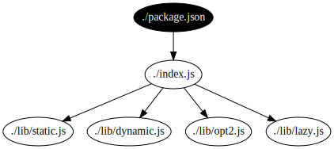

# Dynamic Bundling

Consider a simple Node application:

```js
// index.js
// Example that uses various require(...) use cases.

let staticLoad = require('./lib/static');
function dynamicLoad(f, x) {
  return f('./lib/' + x);
}
dynamicLoad(require, Math.random() < 2 ? 'dynamic' : 'bogus');
exports.lazyLoad = () => require('./lib/lazy');

// Fallback to alternatives
require(['./lib/opt1', './lib/opt2'].find(
    (name) => {
      try {
        require.resolve(name);
        return true;
      } catch (_) {
        return false;
      }
    }));
```

with some unit tests:

```js
// test/test.js

var expect = require("chai").expect;
var app = require("../index");

describe("My TestSuite", () => {
  describe("A test", () => {
    it("A unittest", () => {
      // Exercise the API
      app.lazyLoad();
    });
  });
});
```

We hack `updateChildren`, which gets called by `Module._load` for new
modules and when a module requires a cached module, to dump information
about loads:

```diff
diff --git a/lib/module.js b/lib/module.js
index cc8d5097bb..945ab8a4a8 100644
--- a/lib/module.js
+++ b/lib/module.js
@@ -59,8 +59,18 @@ stat.cache = null;

 function updateChildren(parent, child, scan) {
   var children = parent && parent.children;
-  if (children && !(scan && children.includes(child)))
+  if (children && !(scan && children.includes(child))) {
+    if (parent.filename && child.id) {
+      // HACK: rather than require('fs') to write a file out, we
+      // log to the console.
+      // We assume the prefix will be removed and the result wrapped in
+      // a DOT digraph.
+      console.log(
+          'REQUIRE_LOG_DOT:    ' + JSON.stringify(parent.filename)
+          + ' -> ' + JSON.stringify(child.id) + ';');
+    }
     children.push(child);
+  }
 }
```

Running the tests and extracting the graph ([code][extract-script])
gives us a rather [hairy dependency graph](example/graphs/full.svg):


We add an edge from `"./package.json"` to the module's main file.
Then we filter edges ([code][graph-filter]) to include only those
reachable from `"./package.json"`.  This lets us distinguish files
loaded by the test runner and tests from those loaded after control
has entered an API in a production file.

The resulting graph is much simpler:



Note that the production file list includes dynamically and lazily
loaded files.  It does include `./lib/opt2.js` but not `./lib/opt1.js`.
The former file does not exist, so the loop which picks the first
available alternative tries and finds the latter.

Our production source list should include all the files we need
in production if

*  The unit tests `require` the main file
*  The unit tests have enough coverage to load all modules required
   in production via APIs defined in the main file or in APIs
   transitively loaded from there.

It is definitely possible to miss some files.  If the unit test did
not call `app.lazyLoad` then there would be no edge to
`./lib/lazy.js`.  To address this, developers can

*  Expand test coverage to exercise code paths that load the
   missing source files.
*  Or add an explicit whitelist like
   ```js
   // production-source-whitelist.js
   require('./index.js');
   require('./lib/lazy.js');
   ```
   and explicitly pass this as the main file to the filter
   instead of defaulting to the one specified in `package.json`.

Dynamic analysis is not perfect, but a missing source file is
readily apparent, so this replaces

*  hard-to-detect bugs with potentially severe security consequences,

with

*  easy-to-detect bugs with negligible security consequences.

[extract-script]: https://github.com/google/node-sec-roadmap/blob/master/chapter-2/example/make_dep_graph.sh
[graph-filter]: https://github.com/google/node-sec-roadmap/blob/6130b76446ff4efbb276d8128c12e41ea2fffbc9/chapter-2/example/make_dep_graph.sh#L39-L73
