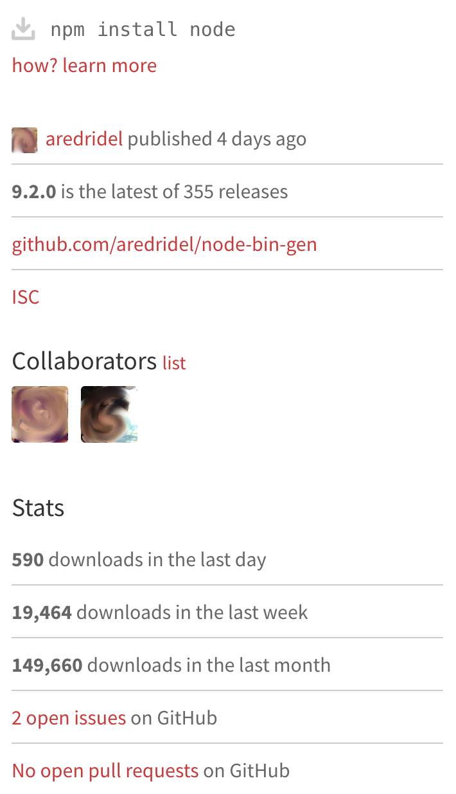

# Knowing your dependencies

## Background

[`npmjs` search results][npmjs/node] have stats on download count and
open issues and PRs.

Each package page also links to the corresponding GitHub project
which has links to the project's [pulse][github-pulse].

Both of these give an idea of how popular the project is, and
whether it's actively developed.

On their Github pages, many projects proudly display
[badges and shields][] indicating their continuous integration status,
and other vital statistics.

The Linux Core Infrastructure project espouses a set of
[best practices badges][bpb] and define tiers for mature infrastructure
projects.  We get some of the basic items for free by distributing via
`npm`, but other items bear on how responsive the project might be to
vulnerability reports and how it might respond to attempts to inject
malicious code:

*  Another will have the necessary access rights if someone dies
*  Monitor external dependencies to detect/fix known vulnerabilities
*  At least 2 unassociated significant contributors
*  Use 2FA
*  At least 50% of all modifications are reviewed by another
*  Have a security review (internal or external)

"Use 2FA" is possible with npm but it is not clear that it is widely
practiced.  [MTP][] discusses the support already built into Github
and `npm profile`.

## Problem

Threats: [LQC][] [MTP][]

The npm repository, like other open-source code repositories,
contains mature and well-maintained modules, but also plenty of
bleeding-edge code that has not yet had bugs ironed out.

A wise technical lead might decide that they can use third-party
dependencies that have been widely used in production for several
years by projects with similar needs since gross errors are likely
to have been fixed.

That technical lead might also decide that they can use bleeding edge
code when they have enough local expertise to vet it, identify
corner-cases they need to check, and fix any gross errors they
encounter.

Either way, that decision to use bleeding-edge code or code that might
not be maintained over the long term should be a conscious one.

## Success Criteria

Development teams are rarely surprised when code that they had built a
prototype on later turns out not to be ready for production use, and
they do not have to pore over others' code to vet many dependencies.

## A Possible Solution

The building blocks of a solution probably already exist.

### Aggregate more signals

`npmjs.com` may or may not be the right place to do this, but we
should, as a community, aggregate signals about modules and make
them readily available.

`npmjs.com/package` already aggregates some useful signals, but
it or another forum could aggregate more including

-  More of the GitHub pulse information including
   closed issues, PRs over time.
-  Relevant badges & shields for the project itself.
-  Relevant badges & shields by percentage of transitive
   dependencies and peer dependencies that have them.
-  Support channels, e.g. slack & discord.
-  Vulnerability reports and the version they affect.
   See sources in ["When all else fails"][failing]
-  Weighted mean of age of production dependencies transitively.
-  Results of linters (see [oversight][]) run without respecting
   [inline ignore comments][eslint-ignore-line] and
   [file ignore directives][eslint-ignore-file].

Users deciding whether to buy something from an online store or
download a cellphone app from an app store have reviews
and comments from other users.  That members of the community take
time to weigh in can be a useful signal, and the details can help
clarify whether this module or an alternative might be better for a
specific use.

Large organizations who host [internal replicas][] may already have a
lot of the opinion available internally, but aggregating that across
clients can help smaller organizations and large organizations
that are debating whether to dip their toe in.

### Leadership & Developer outreach

The node runtime already [passes][CI-node] the Linux Foundation's best
practices criteria, but could lead the way by explaining how a project
that pushes from GitHub to `registry.npmjs.org` can pass more of these
criteria.

[npmjs/node]: https://www.npmjs.com/package/node
[github-pulse]: https://github.com/blog/1476-get-up-to-speed-with-pulse
[badges and shields]: https://github.com/badges/shields
[bpb]: https://github.com/coreinfrastructure/best-practices-badge
[internal replicas]: ../chapter-4/close_dependencies.md
[failing]: ../chapter-6/failing.md
[CRY]: ../chapter-1/threat-CRY.md
[LQC]: ../chapter-1/threat-LQC.md
[MTP]: ../chapter-1/threat-MTP.md
[oversight]: ../chapter-5/oversight.md
[eslint-ignore-line]: https://eslint.org/docs/user-guide/configuring#disabling-rules-with-inline-comments
[eslint-ignore-file]: https://eslint.org/docs/user-guide/configuring#ignoring-files-and-directories
[CI-node]: https://bestpractices.coreinfrastructure.org/projects?gteq=50&q=Node.js
